# Hotel Reservation System
## Group Info:
- Group Number: 11
- Case Study: Hotel Reservation System
- Course: Software Engineering
- Instructor: Dr. Samer Elkababji

### Student Names and IDs:
- Reef Thneibat   20230107
- Omar Tardi		20220598
- Renad Alsayyed	20230485
- Mohammad Amaireh  20230108

## Overview:
```
A web-based and database-driven system that enables customers to search for
available rooms, make reservations, and complete online payments. The system
allows hotel staff to manage room availability, guest check-ins and check-outs,
and billing processes. It streamlines hotel operations by integrating front-desk
management, room scheduling, and payment handling in a single interface.
The system maintains records of guests, room types, bookings, and transactions.
Integration with payment gateways, email services, and inventory modules ensures
real-time booking confirmation and efficient management of resources such
as housekeeping and maintenance.
```
### Tools Used:
- VS Code
- Draw.io (VS Code extension and Website)
- PlantUML
- Github
- Pandoc

## Diagrams:
1. C4 Context Diagram (L1)
    - Shows external actors interacting with the system.

2. C4 Container Diagram (L2)
    - Displays internal system containers and services.

3. Use Case Diagram
    - Represents user interactions with the system.

4. Sequence Diagrams
    - Shows interaction flow between components.

5. Class Diagram
    - Models system structure and relationships.

6. Activity Diagram
    - Describes booking workflow.

7. State Diagram
    - Represents room state transitions.

## Repo Structure:

```
Hotel-Reservation-System/
|
|-- README.md
|
|-- docs/
|   |-- report.md
|   `-- report.pdf
|
|-- images/
|   |-- activity_diagram.png
|   |-- class_diagram.png
|   |-- container_diagram.png
|   |-- context_diagram.png
|   |-- detailed_seq_diagram.jpg
|   |-- front_desk_usecase.jpg
|   |-- high_level_checkin_seq_diagram.jpg
|   |-- high_level_checkout_seq_diagram.jpg
|   |-- hotel_admin_usecase.jpg
|   |-- maintenance_housekeeping_usecase.jpg
|   |-- online_reservation_usecase.jpg
|   `-- state_diagram.jpeg
|
`-- uml/
    |-- activity_diagram.xml
    |-- class_diagram.xml
    |-- container_diagram.xml
    |-- detailed_seq_diagram.xml
    |-- hotel_usecases.puml
    |-- checkin_sequence.xml
    |-- checkout_sequence.xml
    |-- state_diagram.xml
    `-- context_diagram.xml
```

## Contributions:
| Member | Contribution | Number Of Commits
|---|---|---|
| Reef Thneibat | Report, class diagram, context and container diagrams, activity diagram | 6
| Omar Tardi | Use cases and use cases descriptions |5
| Renad Alsayyed | Detailed sequence diagram and state stimulus tables | 4
| Mohammad Amaireh  | High-level sequence diagrams and State diagram | 6

# System Description

The Hotel Reservation System is a web-based and database-driven platform designed to streamline hotel operations and improve the overall guest experience. The system provides an integrated environment that allows customers to search for available rooms, make reservations, complete online payments, and manage bookings efficiently. In addition, hotel staff can oversee daily operational activities such as room assignments, guest check-ins and check-outs, housekeeping coordination, maintenance tracking, and financial reporting through a centralized interface.

The primary objective of the system is to automate and simplify traditional hotel management processes that are often handled manually or through disconnected systems. By integrating reservation management, room scheduling, payment handling, housekeeping services, and reporting into a single platform, the system reduces operational delays, minimizes human errors, and improves communication between hotel departments.

The system supports multiple categories of users, each with specific roles and responsibilities. Guests interact with the system to create accounts, search for available rooms based on preferences such as room type, price, and capacity, and complete reservations using secure online payment services. Guests can also modify or cancel reservations, review booking history, and provide feedback after their stay. These features improve customer convenience while ensuring a smooth booking experience.

Receptionists and front-desk staff use the system to manage guest arrivals and departures. During check-in, the receptionist verifies reservation details, assigns rooms, and records guest information. At check-out, the system generates invoices, processes payments, and updates room availability automatically. The system also supports walk-in reservations, enabling staff to allocate rooms immediately based on real-time availability.

Hotel managers are responsible for administrative and monitoring functions within the system. Through the management module, administrators can manage room inventory, define room types and pricing strategies, create promotional offers, maintain staff accounts, and generate analytical reports. These reports provide insights into occupancy rates, revenue trends, and guest statistics, supporting business decision-making and operational planning.

The system also includes housekeeping and maintenance functionalities to ensure efficient room management. Housekeeping staff can access cleaning schedules, update room statuses in real time, inspect room quality, and notify the front desk when rooms become available. Maintenance staff can receive and track repair requests related to room equipment, safety concerns, or facility issues. This coordination helps maintain service quality and ensures rooms are prepared promptly for incoming guests.

From a technical perspective, the Hotel Reservation System follows a data-driven architecture because its core functionality depends heavily on storing, retrieving, and processing persistent data. The system maintains records related to guests, reservations, rooms, invoices, payments, staff accounts, maintenance requests, and housekeeping schedules within a centralized database. Most system operations involve validating, updating, and managing this data efficiently. However, some components also demonstrate event-driven behavior, particularly room state transitions such as Available, Reserved, Occupied, Cleaning, and Ready.

The system integrates with external services such as payment gateways and email notification services. Payment gateway integration enables secure online transactions, while email services automatically send booking confirmations, invoices, and reservation updates to guests. These integrations enhance system reliability and improve communication with users.

Overall, the Hotel Reservation System provides a comprehensive solution for managing hotel operations digitally. By combining reservation handling, operational management, reporting, and interdepartmental coordination into a single platform, the system improves efficiency, enhances customer satisfaction, and supports effective hotel administration.

# Context Diagram (C4 L1) 
### Explanation

The C4 Context Diagram provides a high-level overview of the Hotel Reservation System and its interaction with external actors and services. It identifies the primary users of the system including guests, receptionists, hotel managers, housekeeping staff, and maintenance staff. The diagram also shows external systems such as payment gateways and email services that communicate with the platform. Its purpose is to define the system boundary and illustrate how external entities interact with the hotel management environment.

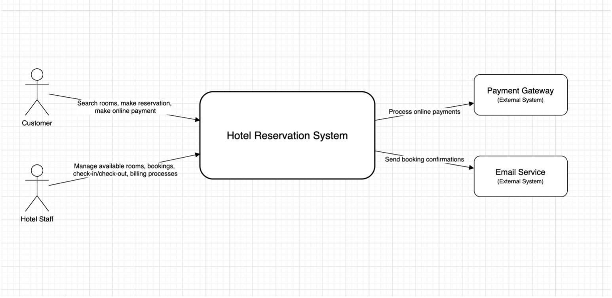

# Container Diagram (C4 L2) 
### Explanation

The C4 Container Diagram illustrates the internal structure of the Hotel Reservation System by dividing it into major containers and services. It shows components such as the web application, Business Logic, database system, and notification service. The diagram demonstrates how these containers communicate to process bookings, manage room availability, and handle operational workflows.

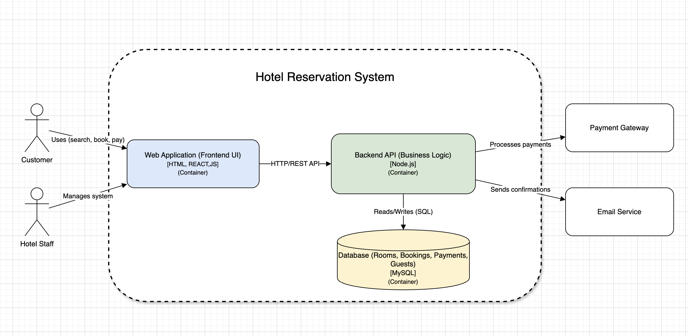

# Activity Diagram with Swimlanes 
### Explanation

The Activity Diagram with Swimlanes represents the workflow of the Hotel Reservation System while dividing responsibilities among different actors and system components. The swimlanes separate activities performed by guests, receptionists, housekeeping staff, and the system itself, making the interaction flow easier to understand.

The process starts when a guest searches for available rooms and submits a reservation request. The system validates room availability, processes payment through the payment gateway, and confirms the booking by sending a confirmation email. Receptionists manage guest check-in and check-out operations, while housekeeping staff update room status and prepare rooms for future reservations.

The diagram also includes decision points for scenarios such as payment failure, booking cancellation, or maintenance requests. Overall, the activity diagram demonstrates how tasks and responsibilities are coordinated across different hotel departments to support smooth hotel operations.

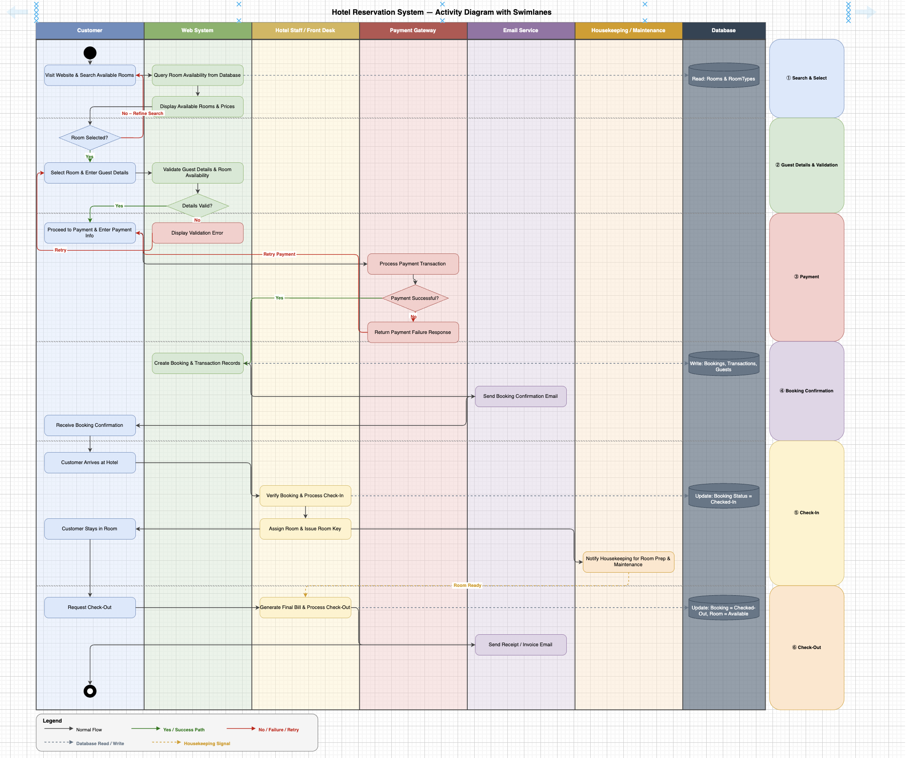

# Use Case Diagram 
### Explanation
The Use Case Diagram models the functional requirements of the Hotel Reservation System by representing interactions between system actors and available functionalities. It highlights how guests perform booking-related operations, how receptionists manage check-ins and check-outs, how hotel managers oversee administrative functions, and how housekeeping and maintenance staff coordinate operational activities. Include and extend relationships are used to represent dependencies between system functions.

- Online Reservation Use-Case:

    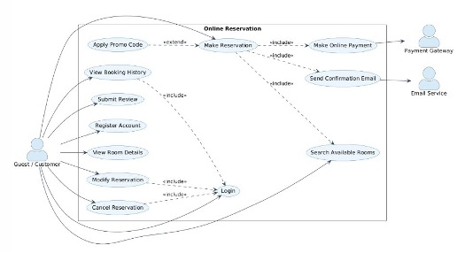

- Front Desk Use-Case:

    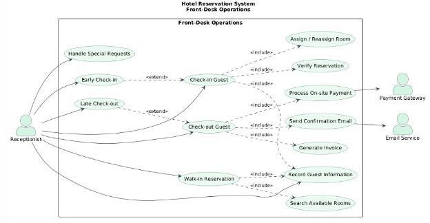

- Hotel Admin Use-Case:

    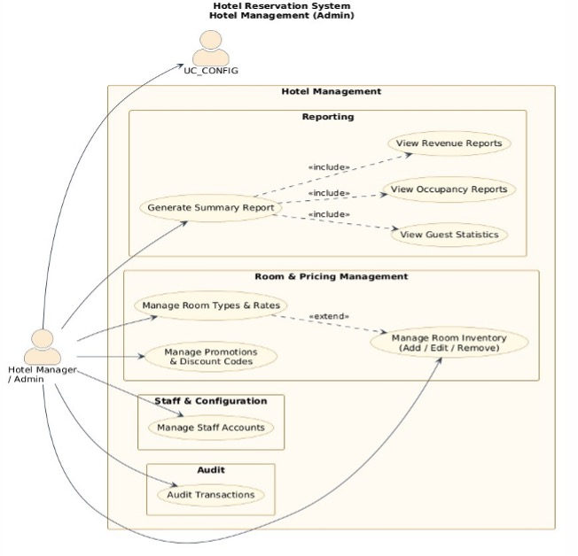

- Maintenance and Housekeeping Use-Case:

    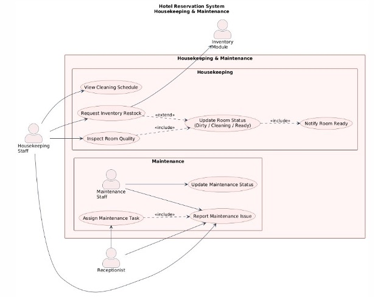

# Use Case Descriptions (Tabular Format) 

**Diagram 1 - Online Reservation (Guest-Facing)**

| # | Use Case | Actors | Description | Relationship |
|---|---|---|---|---|
| 1 | **Register Account** | Guest | New user creates a profile with personal details. | --- |
| 2 | **Login** | Guest | Authenticates user before accessing protected features. | «include» by Modify Reservation, Cancel Reservation, View Booking History |
| 3 | **Search Available Rooms** | Guest | Filters rooms by date, type, capacity, and price. | «include» by Make Reservation |
| 4 | **View Room Details** | Guest | Shows photos, amenities, and pricing for a selected room. | --- |
| 5 | **Make Reservation** | Guest | Books a room for chosen dates and confirms the booking. | «include» Search Available Rooms, Make Online Payment, Send Confirmation Email |
| 6 | **Apply Promo Code** | Guest | Optionally applies a discount code to reduce the total. | «extend» Make Reservation |
| 7 | **Make Online Payment** | Guest, Payment Gateway | Processes booking payment securely via payment gateway. | «include» by Make Reservation |
| 8 | **Send Confirmation Email** | Email Service | Emails booking confirmation and receipt automatically. | «include» by Make Reservation |
| 9 | **Modify Reservation** | Guest | Changes dates, room type, or guest count before check-in. | «include» Login |
| 10 | **Cancel Reservation** | Guest | Cancels booking and triggers refund if policy allows. | «include» Login |
| 11 | **View Booking History** | Guest | Lists past and upcoming reservations with status. | «include» Login |
| 12 | **Submit Review** | Guest | Allows post-stay feedback and star rating submission. | --- |

**Diagram 2 -  Front-Desk Operations**

| # | Use Case | Actors | Description | Relationship |
|---|---|---|---|---|
| 1 | **Check-in Guest** | Receptionist | Processes arrival, verifies booking, and assigns room. | «include» Verify Reservation, Assign/Reassign Room, Record Guest Information |
| 2 | **Verify Reservation** | Receptionist | Confirms booking validity, identity, and payment status. | «include» by Check-in Guest |
| 3 | **Assign / Reassign Room** | Receptionist | Allocates or changes a room based on availability. | «include» by Check-in Guest |
| 4 | **Check-out Guest** | Receptionist | Finalizes stay, generates invoice, and settles payment. | «include» Generate Invoice, Process On-site Payment, Send Confirmation Email |
| 5 | **Generate Invoice** | Receptionist | Compiles all charges into a printable bill. | «include» by Check-out Guest |
| 6 | **Process On-site Payment** | Receptionist, Payment Gateway | Accepts cash or card payment at the front desk. | «include» by Check-out Guest |
| 7 | **Walk-in Reservation** | Receptionist | Creates an immediate booking for a guest without prior reservation. | «include» Search Available Rooms, Record Guest Information |
| 8 | **Search Available Rooms** | Receptionist | Checks real-time room availability for walk-ins. | «include» by Walk-in Reservation |
| 9 | **Record Guest Information** | Receptionist | Captures or updates guest ID, contact, and preferences. | «include» by Check-in Guest, Walk-in Reservation |
| 10 | **Handle Special Requests** | Receptionist | Logs extra needs such as accessibility aids or extra beds. | --- |
| 11 | **Early Check-in** | Receptionist | Accommodates arrival before standard check-in time. | «extend» Check-in Guest |
| 12 | **Late Check-out** | Receptionist | Permits stay past standard check-out time, possibly with extra charge. | «extend» Check-out Guest |
| 13 | **Send Confirmation Email** | Email Service | Sends check-out receipt or booking confirmation to guest. | «include» by Check-out Guest |

**Diagram 3 - Hotel Management (Admin)**

| # | Use Case | Actors | Description | Relationship |
|---|---|---|---|---|
| 1 | **Manage Room Inventory** | Hotel Manager | Add, edit, or deactivate rooms including type and features. | --- |
| 2 | **Manage Room Types & Rates** | Hotel Manager | Define categories and set seasonal or dynamic pricing rules. | «extend» Manage Room Inventory |
| 3 | **Manage Promotions** | Hotel Manager | Create and control discount codes and flash deals. | --- |
| 4 | **Manage Staff Accounts** | Hotel Manager | Create, edit, and deactivate staff logins and permissions. | --- |
| 5 | **Generate Summary Report** | Hotel Manager | Aggregates occupancy, revenue, and guest data into one report. | «include» View Occupancy Reports, View Revenue Reports, View Guest Statistics |
| 6 | **View Occupancy Reports** | Hotel Manager | Tracks room fill rates, peak periods, and availability trends. | «include» by Generate Summary Report |
| 7 | **View Revenue Reports** | Hotel Manager | Summarizes income by room type, period, and payment method. | «include» by Generate Summary Report |
| 8 | **View Guest Statistics** | Hotel Manager | Analyzes guest demographics and return rates. | «include» by Generate Summary Report |
| 9 | **Audit Transactions** | Hotel Manager | Reviews payment logs, refunds, and billing adjustments. | --- |

**Diagram 4 - Housekeeping & Maintenance**

| # | Use Case | Actors | Description | Relationship |
|---|---|---|---|---|
| 1 | **View Cleaning Schedule** | Housekeeping Staff | Shows daily rooms to clean sorted by priority and check-out status. | --- |
| 2 | **Inspect Room Quality** | Housekeeping Staff | Performs post-clean quality check before marking room as ready. | «include» Update Room Status |
| 3 | **Update Room Status** | Housekeeping Staff | Marks room as Dirty, Cleaning, or Ready in real time. | «include» Notify Room Ready |
| 4 | **Notify Room Ready** | Housekeeping Staff | Alerts front desk that a room is available for assignment. | «include» by Update Room Status |
| 5 | **Request Inventory Restock** | Housekeeping Staff, Inventory Module | Submits requests for supplies or amenities to the inventory module. | «extend» Update Room Status |
| 6 | **Report Maintenance Issue** | Housekeeping Staff, Receptionist, Maintenance Staff | Flags a broken fixture, fault, or safety concern. | «include» by Assign Maintenance Task |
| 7 | **Assign Maintenance Task** | Receptionist | Allocates a reported issue to maintenance staff with priority. | «include» Report Maintenance Issue |
| 8 | **Update Maintenance Status** | Maintenance Staff | Records progress (In Progress / Resolved) on assigned tasks. | --- |
# Sequence Diagrams 

- ### High-Level
    #### Explanation
    The High-Level Sequence Diagram presents the interaction flow between external stakeholders and the Hotel Reservation System during major processes such as room reservation and payment confirmation. The diagram focuses on the overall communication sequence without exposing internal implementation details, making it easier to understand the business workflow from a user perspective.
    - Check-In
    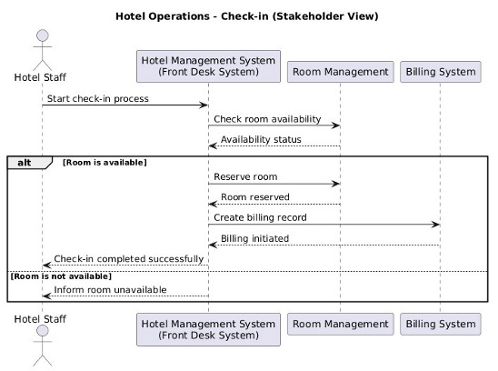
    - Check-Out
    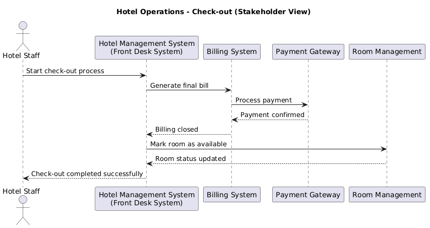

- ### Detailed
    #### Explanation
    The Detailed Sequence Diagram describes the communication between internal system components during a reservation transaction. It illustrates interactions between the web interface, controllers, business services, payment modules, and database systems. The diagram provides a deeper understanding of request processing, validation, and data handling within the system architecture.

    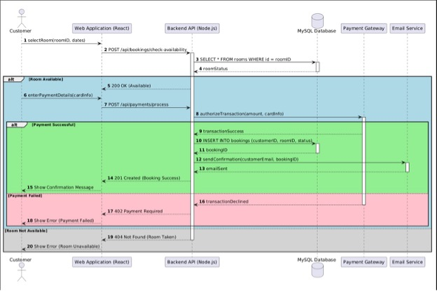

# Class Diagram
### Explanation
The Class Diagram represents the structural design of the Hotel Reservation System. It defines the system classes, their attributes, methods, and relationships such as associations, inheritance, aggregation, and composition. Key entities including Guest, Reservation, Room, Payment, Invoice, and Staff are modeled to demonstrate how system data and operations are organized.

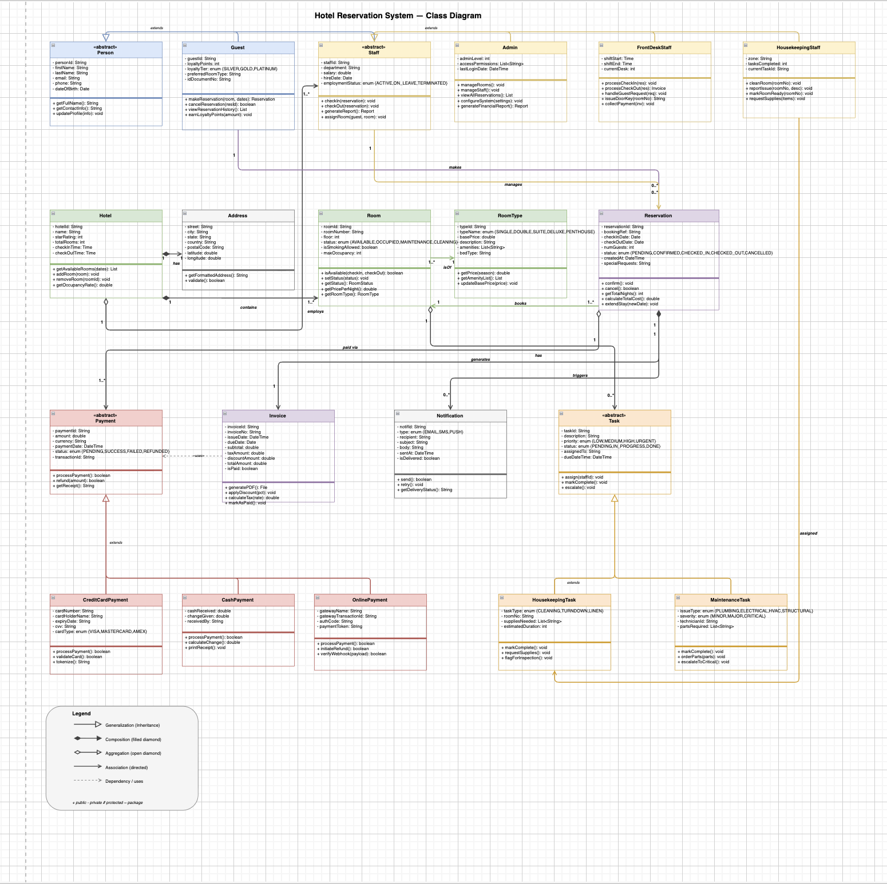

# State Diagram
### Explanation
The State Diagram models the lifecycle of hotel rooms within the system. It demonstrates how room states transition between Available, Reserved, Occupied, Cleaning, and Ready based on user actions and operational events such as reservations, check-ins, check-outs, and housekeeping updates. The diagram helps visualize event-driven behavior within the system.

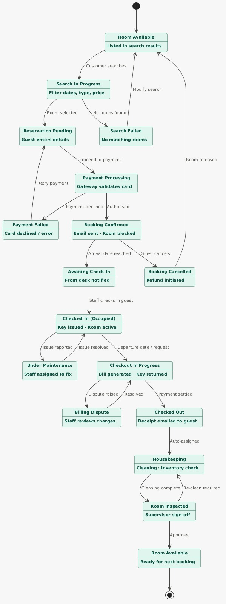

# Stimulus-State Table
### Explanation
The Stimulus-State Table describes how the Hotel Reservation System transitions between different states in response to user actions and operational events. It models the lifecycle of room booking activities from room availability and reservation processing to check-in, checkout, housekeeping, and maintenance operations. The table helps visualize the dynamic behavior of the system and validates the transitions represented in the UML State Diagram.

| # | Current State | Stimulus / Event | Next State | Action / Notes |
|---|---|---|---|---|
| 1 | **[Initial]** | --- | **Room Available** | Room is listed in search results; lifecycle begins. |
| 2 | **Room Available** | Customer searches | **Search In Progress** | Guest applies filters: dates, room type, price. |
| 3 | **Search In Progress** | Room selected | **Reservation Pending** | Guest picks a room and enters personal/booking details. |
| 4 | **Search In Progress** | No rooms found | **Search Failed** | No matching rooms for the given criteria. |
| 5 | **Search Failed** | Modify search | **Room Available** | Guest adjusts filters and returns to searchable inventory. |
| 6 | **Reservation Pending** | Proceed to payment | **Payment Processing** | Payment gateway validates the guest's card. |
| 7 | **Payment Processing** | Authorised | **Booking Confirmed** | Confirmation email sent; room blocked on calendar. |
| 8 | **Payment Processing** | Payment declined | **Payment Failed** | Card declined or gateway error encountered. |
| 9 | **Payment Failed** | Retry payment | **Payment Processing** | Guest re-enters or corrects card details. |
| 10 | **Booking Confirmed** | Arrival date reached | **Awaiting Check-In** | Front desk is notified of upcoming arrival. |
| 11 | **Booking Confirmed** | Guest cancels | **Booking Cancelled** | Refund process initiated per cancellation policy. |
| 12 | **Booking Cancelled** | Room released | **Room Available** | Room returns to available inventory for new bookings. |
| 13 | **Awaiting Check-In** | Staff checks in guest | **Checked In (Occupied)** | Key issued to guest; room marked as occupied. |
| 14 | **Checked In (Occupied)** | Issue reported | **Under Maintenance** | Staff assigned to fix the reported issue. |
| 15 | **Checked In (Occupied)** | Departure date / request | **Checkout In Progress** | Bill generated; guest returns room key. |
| 16 | **Under Maintenance** | Issue resolved | **Checked In (Occupied)** | Room restored to active occupancy after fix. |
| 17 | **Checkout In Progress** | Dispute raised | **Billing Dispute** | Staff reviews disputed charges with guest. |
| 18 | **Checkout In Progress** | Payment settled | **Checked Out** | Receipt emailed to guest; stay concluded. |
| 19 | **Billing Dispute** | Resolved | **Checkout In Progress** | Charges adjusted/confirmed; checkout resumes. |
| 20 | **Checked Out** | Auto-assigned | **Housekeeping** | Cleaning crew and inventory check assigned. |
| 21 | **Housekeeping** | Cleaning complete | **Room Inspected** | Supervisor sign-off required before release. |
| 22 | **Room Inspected** | Re-clean required | **Housekeeping** | Room fails inspection and is sent back for re-cleaning. |
| 23 | **Room Inspected** | Approved | **Room Available** | Room passes inspection and is ready for next booking. |
| 24 | **Room Available** | --- | **Ready for Next Booking** | Terminal state; lifecycle complete and cycle may restart. |
